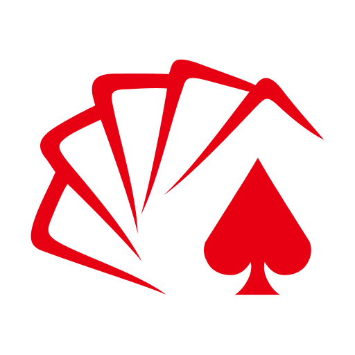
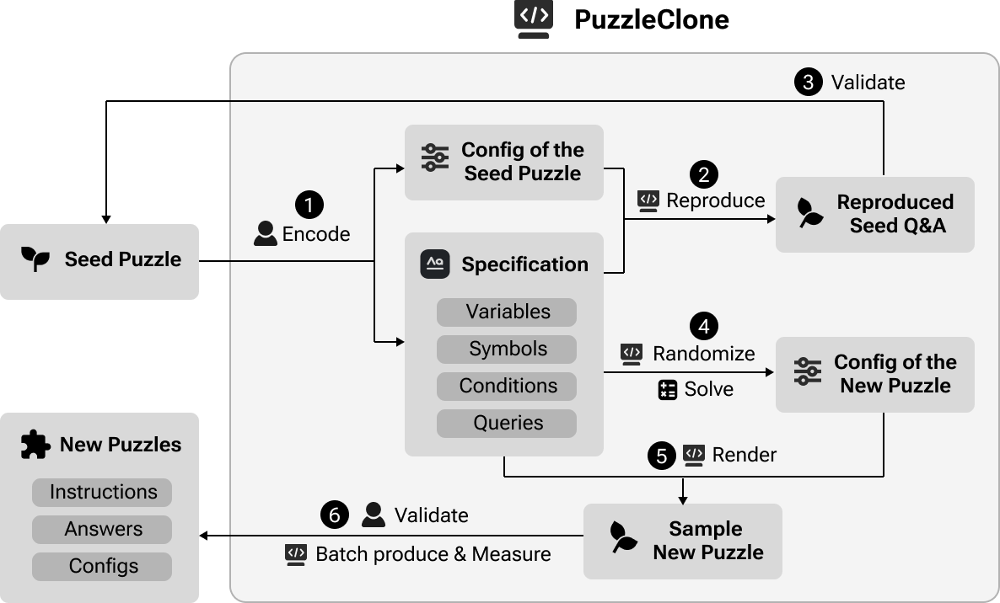
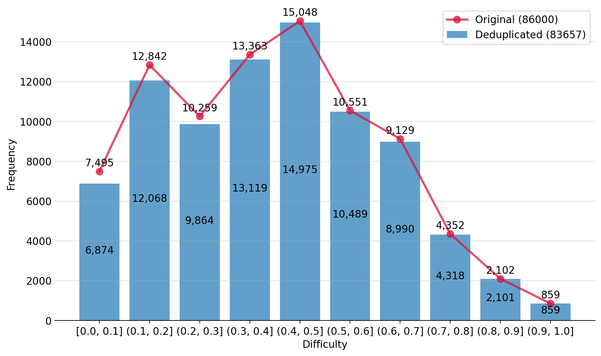
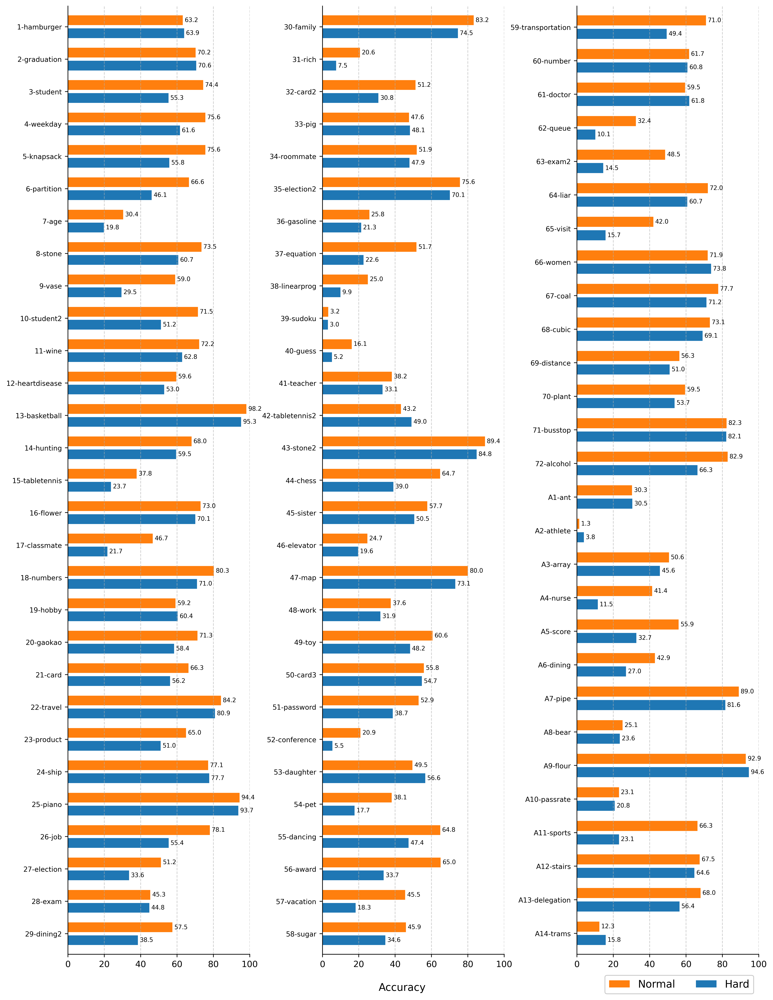
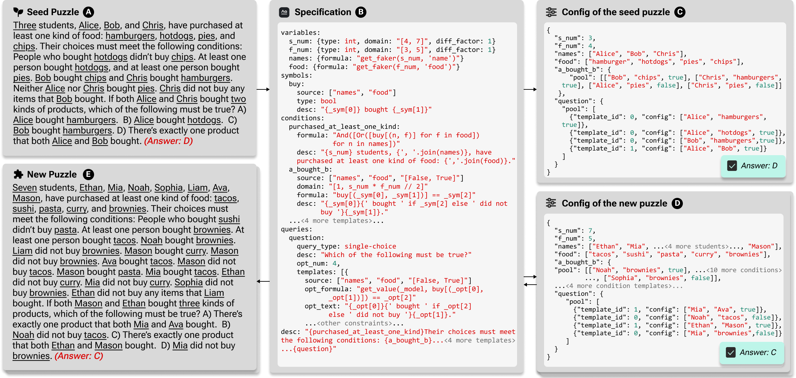

<p align="center">
  <h1 align="center">
    
    PuzzleClone: A DSL-Powered Framework for Synthesizing Verifiable Data
  </h1>
</p>

<p align="center">
  <strong>Kai Xiong</strong><sup>1*</sup>,
  <strong>Yanwei Huang</strong><sup>2*</sup>,
  <strong>Rongjunchen Zhang</strong><sup>1♠</sup>,
  <strong>Kun Chen</strong><sup>1</sup>,
  <strong>Haipang Wu</strong><sup>1</sup>,
  <strong>Yingcai Wu</strong><sup>3</sup>
</p>

<p align="center">
  <sup>1</sup>HiThink Research &nbsp;&nbsp;
  <sup>2</sup>HKUST &nbsp;&nbsp;
  <sup>3</sup>Zhejiang University<br>
  <sub><sup>*</sup>Equal Contribution &nbsp;&nbsp; <sup>♠</sup>Corresponding Author</sub>
</p>

<p align="center">ACL 2026 Findings</p>

<p align="center">
  <a href="https://puzzleclone.github.io/PuzzleClone/api/index.html">[API Docs]</a> |
  <a href="https://puzzleclone.github.io/PuzzleClone/tutorial/">[Tutorials]</a> |
  <a href="https://github.com/puzzleClone/PuzzleCloneData/">[Benchmark]</a> |
  <a href="https://github.com/puzzleclone/PolyhedronEvaluator">[Evaluation Toolkit]</a>
</p>

<p align="center">
  <a href="LICENSE"></a>
  
  <a href="https://github.com/HiThink-Research/PuzzleClone/stargazers"></a>
</p>

<br>

<p align="center">
  
</p>
<p align="center"><i>Overview of the PuzzleClone framework.</i></p>

---

## Table of Contents

- [🧭 Overview](#-overview)
- [📦 PC-83K Benchmark](#-pc-83k-benchmark)
- [📊 Benchmark Results](#-benchmark-results)
- [🔄 Data Synthesis Pipeline](#-data-synthesis-pipeline)
- [🛠️ Quick Start](#️-quick-start)
  - [Environment Setup](#environment-setup)
  - [Generate a Single Test Case](#generate-a-single-test-case)
  - [Generate a Full Dataset](#generate-a-full-dataset)
  - [Apply a New Template](#apply-a-new-template)
- [📚 Documentation](#-documentation)
- [⚖️ License](#️-license)
- [📚 Citation](#-citation)


---

## 🧭 Overview

**PuzzleClone** is a data synthesis framework and comprehensive dataset for logical reasoning problems. It features:
- ✅ **Guaranteed Verifiability:** Every problem is generated with a ground-truth solution and is formally verifiable via a symbolic solver or deterministic program execution, ensuring correctness.
- 🎯 **Granular Control:** Offers fine-grained control over problem attributes like scale, structure, and difficulty through a set of adjustable parameters, enabling large-scale batch generation.
- ✨ **Flexible Adaptation:** Facilitates the easy customization of problem scenarios and translation into different languages or domains.
- 📊 **Expansive and Diverse Coverage:** Based on PuzzleClone, we have curated a [benchmark](https://github.com/puzzleClone/PuzzleCloneData/) including 83,657 unique logical reasoning puzzles procedurally generated from 86 seed questions. The dataset spans:
  - Various applications of Satisfiability Modulo Theories (SMT) and SMT-like puzzles,
  - Classic logical puzzles like Sudoku, the Knapsack problem, and linear optimization (LP).
  - Diverse mathematical problems of varying difficulties.
- 🚀 **State-of-the-Art Performance:** Achieves SOTA results among open-source datasets, outperforming the public dataset by 18.4 points on SATBench (from 51.6 to 70.0).

---

## 📦 PC-83K Benchmark

Applying PuzzleClone, we construct **PC-83K**, a benchmark covering 83,657 unique logical reasoning puzzles. The generated puzzles span Satisfiability Modulo Theories (SMT), SMT-like reasoning tasks, classic puzzles such as Sudoku and knapsack, linear optimization, and diverse mathematical problems.

| Split | SFT | RL-Train | RL-Val | Total Train | Test |
| --- | ---: | ---: | ---: | ---: | ---: |
| Normal | 2,161 | 50,738 | 430 | 51,168 | 5,730 |
| Hard | 2,139 | 23,616 | 430 | 24,046 | 2,713 |
| **Sum** | **4,300** | **74,354** | **860** | **75,214** | **8,443** |

<p align="center">
  
</p>
<p align="center"><i>Puzzle difficulty distribution before and after deduplication.</i></p>

---

## 📊 Benchmark Results

Current LLMs still show large gaps on complex logical reasoning. On PC-83K, stronger reasoning models achieve substantially higher accuracy, while post-training on PC-83K improves Qwen2.5-7B-Instruct from **14.5** to **66.0** average accuracy.

<details>
  <summary>Baseline Performance on PC-83K (Click to Expand)</summary>

| Model | Normal | Hard | Avg. |
| --- | ---: | ---: | ---: |
| ChatGPT-4o | 31.7 | 24.6 | 28.2 |
| ChatGPT-o3 | 87.1 | 83.4 | 85.3 |
| ChatGPT-5 | **91.1** | **86.3** | **88.7** |
| Gemini-2.0-flash | 42.0 | 31.6 | 36.8 |
| Gemini-2.5-pro | 75.8 | 67.2 | 71.5 |
| Gemini-3-pro | 86.5 | 83.0 | 84.8 |
| Claude-3.5-sonnet | 37.6 | 27.4 | 32.5 |
| Claude-4-sonnet | 62.7 | 47.8 | 55.3 |
| Seed1.6 | 87.8 | 82.4 | 85.1 |
| GLM-Z1-9B-0414 | 63.6 | 53.5 | 58.6 |
| GLM-Z1-32B-0414 | 71.1 | 60.9 | 66.0 |
| Qwen2.5-7B-Instruct | 16.8 | 12.1 | 14.5 |
| Qwen2.5-14B-Instruct | 24.3 | 17.9 | 21.1 |
| Qwen2.5-32B-Instruct | 31.4 | 23.5 | 27.4 |
| Qwen2.5-72B-Instruct | 32.8 | 25.3 | 29.0 |
| Qwen3-8B | 71.6 | 59.4 | 65.5 |
| Qwen3-14B | 78.6 | 67.0 | 72.8 |
| Qwen3-32B | 77.0 | 68.1 | 72.5 |
| Qwen3-235B-A22B | 82.9 | 73.8 | 78.3 |
| DeepSeek-R1-Distill-Qwen-14B | 47.9 | 38.4 | 43.1 |
| DeepSeek-R1-Distill-Qwen-32B | 53.3 | 43.2 | 48.3 |
| DeepSeek-R1-0528-Qwen3-8B | 76.0 | 66.8 | 71.4 |
| DeepSeek-R1-0528 | 88.7 | 82.6 | 85.6 |

</details>

<details>
  <summary>Post-Training Results (Click to Expand)</summary>

| Model | PC-83K Normal | PC-83K Hard | PC-SL-35K | SATBench | BBEH-mini | AIME24 | AIME25 | AMC2023 | MATH500 | OlympiadBench |
| --- | ---: | ---: | ---: | ---: | ---: | ---: | ---: | ---: | ---: | ---: |
| Qwen2.5-7B-Instruct | 16.8 | 12.1 | 9.6 | 51.6 | 11.3 | 13.3 | 6.7 | 52.5 | 75.2 | 41.0 |
| SFT | 61.9 | 48.0 | 14.7 | **70.0** | 9.8 | 20.0 | 13.3 | **67.5** | **80.8** | 43.4 |
| RL (PC-83K) | **71.0** | **61.0** | 15.2 | 62.0 | **17.0** | 16.7 | 13.3 | 65.0 | 80.0 | 44.4 |
| SynLogic-7B | - | - | - | - | 8.0 | 10.0 | - | 55.0 | 71.8 | - |
| RL (PC-SL-35K) | 22.0 | 14.3 | **55.3** | 58.4 | 16.5 | **23.3** | 10.0 | 62.5 | 79.8 | 42.4 |
| RL (PC-83K+PC-SL-35K) | 64.8 | 54.1 | 54.2 | 57.2 | **17.0** | 16.7 | **16.7** | 60.0 | 80.4 | **52.2** |

</details>

<p align="center">
  
</p>
<p align="center"><i>Average accuracy of evaluated models on the PuzzleClone test set, grouped by seed puzzle.</i></p>

---

## 🔄 Data Synthesis Pipeline

PuzzleClone synthesizes data through three stages: **puzzle encoding**, **puzzle generation**, and **config-based validation**. Each seed puzzle is manually encoded into a DSL specification and a config file. The generator then produces randomized configs, renders new puzzle instances, computes reference answers, and validates correctness through deterministic reproduction.

<p align="center">
  
</p>
<p align="center"><i>The data synthesis pipeline of PuzzleClone.</i></p>


---

## 🛠️ Quick Start

### Environment Setup

```bash
git clone https://github.com/HiThink-Research/PuzzleClone.git
cd PuzzleClone
pip install -r requirements.txt
```

### Generate a Single Test Case

Run the translator in test mode to generate a sample question from a specification file:

```bash
python translator.py -t path/to/spec.yaml
```

The generated data (`{spec_name}_data.jsonl`) and debugging files such as `{spec_name}_synthesizer.py` are written to `temp/`.

### Generate a Full Dataset

Run the translator in deployment mode to generate many puzzle instances:

```bash
python translator.py -d path/to/spec.yaml -o data.jsonl
```

If `-o` is omitted, the output is saved to `output/{spec_name}_data.jsonl`.

### Apply a New Template

Use `-g` to load existing puzzle configs and render them with a new specification:

```bash
python translator.py -d path/to/new_spec.yaml -g old_data.jsonl -o new_data.jsonl
```

### Data Transformation

Scripts in [`data_processing_scripts/`](data_processing_scripts/) transform generated data into standard benchmark formats. See [`data_processing_scripts/README.md`](data_processing_scripts/README.md) for details.

### Evaluation

Use [PolyhedronEvaluator](https://github.com/puzzleclone/PolyhedronEvaluator) for benchmark evaluation.

---

## 📚 Documentation

- API documentation: <https://puzzleclone.github.io/PuzzleClone/api/index.html>
- Tutorials: <https://puzzleclone.github.io/PuzzleClone/tutorial/>
- Documentation build notes: [`create_docs.md`](create_docs.md)

---

## ⚖️ License


This project is licensed under the Apache 2.0 License. See [`LICENSE`](LICENSE) for details.

---

## 📚 Citation

If you find PuzzleClone useful, please cite:

```bibtex
@inproceedings{xiong2026puzzleclone,
  title     = {PuzzleClone: A DSL-Powered Framework for Synthesizing Verifiable Data},
  author    = {Xiong, Kai and Huang, Yanwei and Zhang, Rongjunchen and Chen, Kun and Wu, Haipang and Wu, Yingcai},
  booktitle = {ACL 2026 Findings},
  year      = {2026},
  url       = {https://github.com/HiThink-Research/PuzzleClone}
}
```
